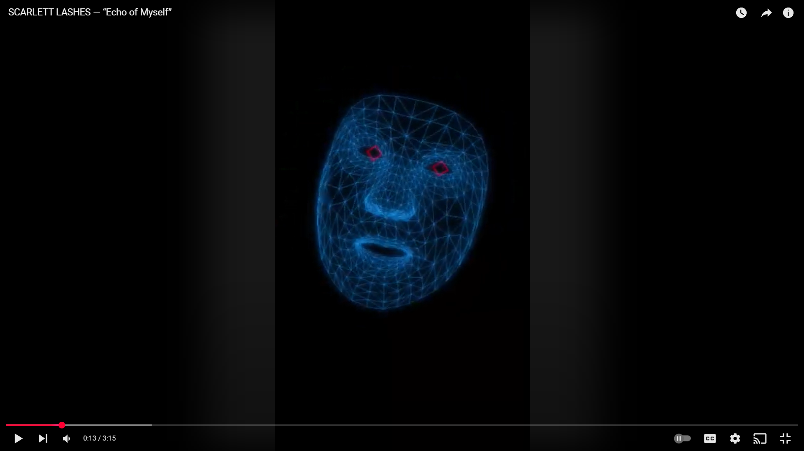

# Echo of Myself music video

## Project Summary
- Collaborated with Aotearoa musician [Scarlett Lashes](https://www.instagram.com/scarlettlashes/ "Scarlett Lashes' Instagram") to create a machine vision-powered music video exploring digital identity.
- Developed custom Python computer vision tools to generate facial/pose tracking overlays, creating a 'glitched echo' aesthetic, mirroring the song's themes.

> "[...] i really love the glitchy feel of it and how it has this creepy feel"

- The artist liked the vibe of a PoC tech demo, as it captured the lyrical themes of the protagonist sitting alone at their device, reflecting on the nature of their online simulacra. 
- We pivoted away from a choreographed ensemble piece and leaned hard into the "Echo of Myself" imagery. Cheaper & easier to film, no need to scout location/dancers.

## Key Achievements
- Translated abstract creative brief into technical solution in 4 weeks
- Built custom video processing pipeline using Python + MediaPipe
- Delivered under tight budget constraints using free & open-source tools

## Workflow 

> "My recording setup was a Frankenstein's monster of smartphone camera hooked up via USB to a PC, capturing audio through OBS, then rendering facial mesh overlays with vibe-coded Python scripts."
 
- I needed a way to overlay and interlace face/hand/body-detection landmarks with video files containing people. Hence, I whipped up *Echo.py*
- Echo has two modes, (1) Live & (2) Batch 
- *Live Mode* is for tweaking parameters/colours in real-time, allowing me to understand what the output would look like before committing to the lengthy processing/rendering sequence.
- *Batch Mode* is for processing/rendering the overlays, and exporting them to a video file.
- Approximated lighting gels by surrounding the subject with LCD screens at max brightness, outputting desired color palette.
- Patched a Samsung Galaxy Z Fold, to take advantage of superior frame rate, aperture, FOV, etc versus laptop webcam.

'''
12MP Ultrawide Camera: 12mm, f/2.2 aperture, 123° field of view, 1.12µm pixels.
'''

- I selected *Kdenlive* for all editing & post-production; it had comparable features to *DaVinci Resolve* with more forgiving system requirements & a slightly smoother learning curve.
